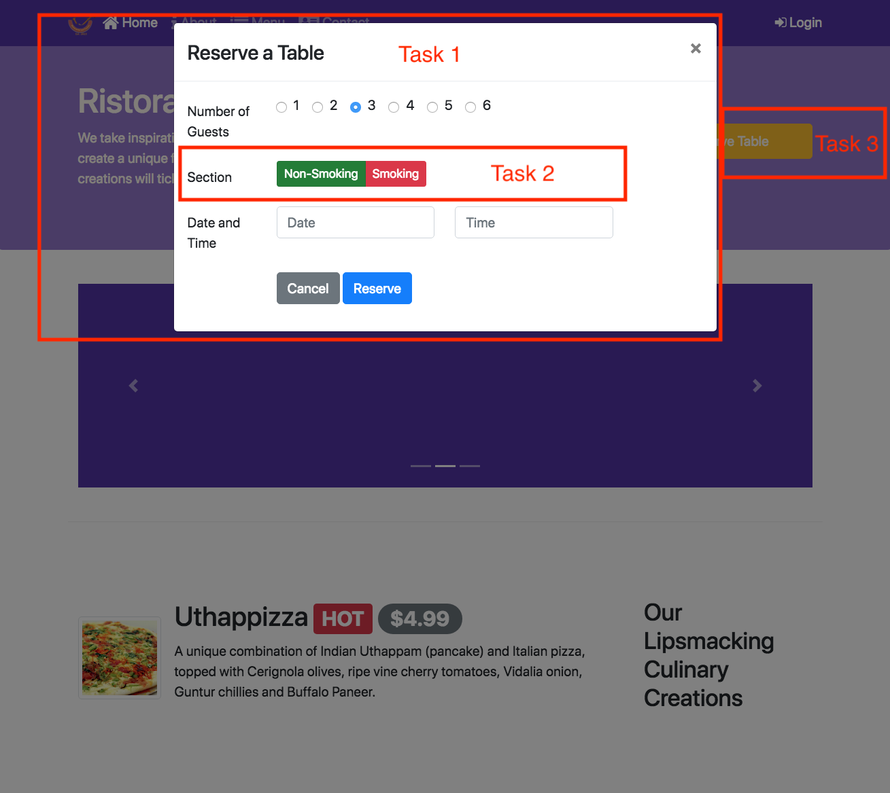

## Assignment 3: Bootstrap JavaScript Components Instructions 

In this assignment you will remove the tooltip from the Reserve table button. Then you will move the table reservation form into a modal that will be shown when the Reserve Table button is clicked. The updated reservation form will include a new radio button group allowing you to select the smoking/non-smoking section of the restaurant.

### Objectives and Outcomes

In this assignment, you will continue to work with the website that you have been developing in the exercises. You will edit the home page (index.html). You will start with the current home page at the end of the last exercise in this module. At the end of this assignment, you should have completed the following tasks:

* Moved the table reservation form from the last content row into a modal.

* Included a radio button group in the table reservation form to enable diners to ask for a table in the smoking/non-smoking 
section of the restaurant.

* Removed the tooltip from the Reserve Table button.

* Updated the Reserve Table button to show the modal containing the table reservation form when the button is clicked.

### Assignment Requirements

This assignment requires you to complete the following four tasks. Detailed instructions for each task are given below. The picture of the completed web page included below indicates the location within the web page that will be updated by the four tasks.

### Task 1

In this task you will move the table reservation form from the last content row into a modal. You should also remove the last content row.

* The form should be completely shifted to a modal.

* Add a Cancel button in the form that will dismiss the modal when clicked.

* The modal header should contain a X button to dismiss the modal.

		
### Task 2

In this task you will be adding a radio button group to the form to allow the selection of the smoking/non-smoking section of the restaurant.

* The radio button group should start out with the non-smoking section selected by default.

* The row containing the button group will have the label Section displayed preceding it in the form.

Note: Read Bootstrap Buttons Checkbox/Radio for more information on how to design checkbox/radio buttons.

### Task 3

In this task you will be updating the Reserve Table button in the Jumbotron:

* Remove the tooltip from the button. This is to facilitate the button to be used to trigger the modal containing the table reservation form in the later tasks. A single button can support only one Javascript plugin via the data-* attributes. Make sure to remove the JavaScript script at the bottom of the page. Also remove the corresponding JavaScript code for the tooltip from the bottom of the page.

* You will update the Reserve Table button to show the modal containing the table reservation form when the button is clicked.

At the end of this assignment, your index.html file should look like this:

### Submission

1. You should submit the updated index.html file with all the tasks completed. A reviewer should easily be able to take your file and substitute it into their own web project and see it working correctly. 
2. Also upload a screenshot of your browser window showing the completed index.html page with the modal containing the table reservation form overlayed on top of the web page in png or jpg format.
		
### Review criteria

Upon completion of the assignment, your submission will be reviewed based on the following criteria:

### Task 1

* The form has been moved into a modal.

* The modal HTML code is included towards the top of the body of the page near the other modal code.

* The modal includes a Cancel button to dismiss the modal.

* The modal header includes a X button to dismiss the modal.

### Task 2

* A correct radio button group with the labels non-smoking in green and smoking in red is included in the form. Use the correct 
button color classes for the buttons.

* The label of the row containing the buttons is set to Section.

* The non-smoking button is checked by default.

### Task 3

* The tooltip has been removed from the Reserve Table button and the corresponding JavaScript code has been removed from the bottom of the page.

* The Reserve Table button will show the modal containing the table reservation form when clicked.