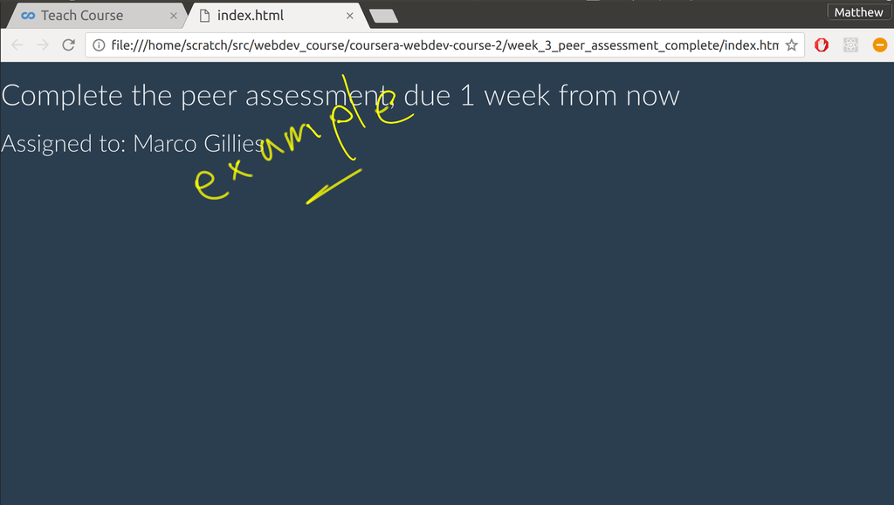

## Assignment 3: Edit a template Instructions

In this assignment, you will edit a handlebars template. You are provided with some starter code and you will make some edits to the code according to the specification. 

### Review criteria

You will be graded by a visual inspection of a screenshot of your web page.

### Step-By-Step Assignment Instructions

### Step 1:

Download the starter code:

### Step 2:

Unzip and open the file index,html in a text editor and also view it in your browser. 
    
### Step 3

Edit index.html so that it includes the file css/bootstrap_blue.css after the boostrap.css file. Check in the browser that the colour theme has changed. (see the example image provided).

### Step 4:

Edit index.html so the template displays the other fields from the data object (var task1). The due_by field should be displayed next to the title and the owner field should be displayed below using an h3 tag. See the example image for how it should look. 

### Step 5:

Edit index.html so that the value of the owner field in the data object (var task1) is set to your name. 

### Step 6: 

Take a screenshot of your web page as it appears in your browser. 

### Example Submissions

Here is an example of how your web page should look:

