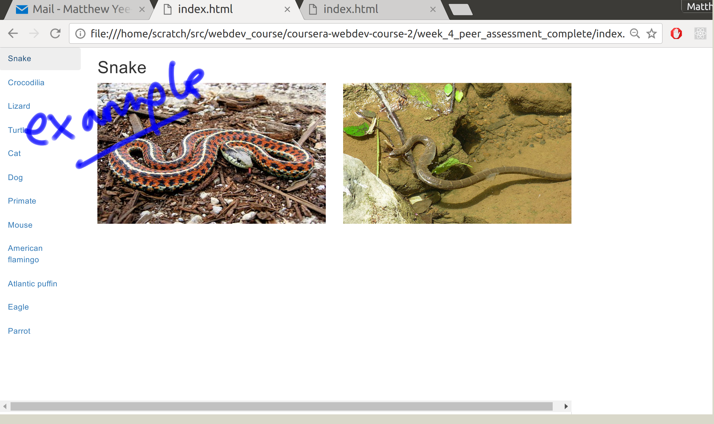

## Assignment 4: Working with navbars Instructions

In this assignment, you will edit an existing web page by adding code to a template and passing data into a template rendering function. You will also think about how to best display the information. 

### Review criteria

You will be assessed via a visual inspection of a screenshot of your web page. 

It will be checked for completion of the various tasks listed in the instructions. 

### Step-By-Step Assignment Instructions

### Step 1:

Download and unzip the starter code.

### Step 2:

View it in your web browser and open index.html in your text editor.
    
### Step 3

Edit the contents of the script tag (where is says '// HERE IS WHERE YOU COME IN...'according to the instructions you will find in the code - eseentially you are aiming to render a template using the data for a single animal. You will know it works when the name of the animal you clicked on appears in the right hand panel of the web page.

### Step 4:

Edit the contents of the animal-detail-template so it displays two images. It is up to you how you lay it out, but think about how it will look on different sized screens. 

### Step 5:

For bonus points, the challenge exercise is to implement a collapsible nav so that the list of animal names collapses as seen earlier in the course when the screen is narrow. 

Remember that you can test responsive behaviour by resizing your browser window. 

Good luck! 

### Example Submissions

Here is an example screenshot showing how the web page might look:

