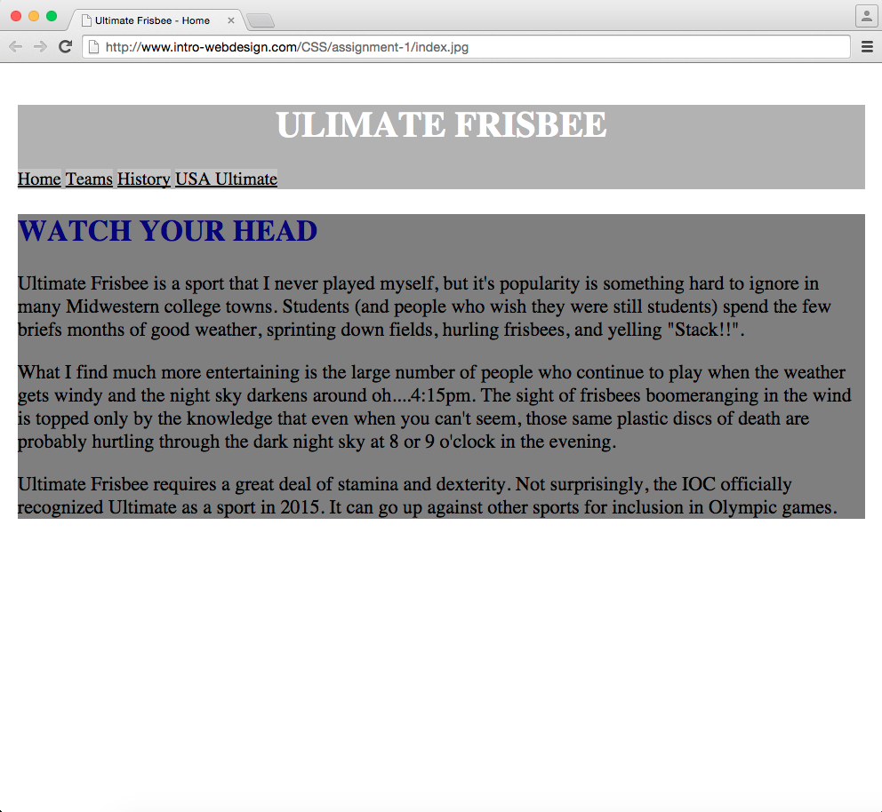

## Assignment: Final Project Instructions

In this assignment you will take my HTML code and create a single html file called hw1.css.  It should style the page following the guidelines provided. See example final product below. 

### Review criteria
You will review each submission based on whether each objective/style is achieved or not, and at what level. (For instance, did they put in background-color and if so, did they use hexadecimal or rgb.)

Specifically, you will evaluate submissions by answering the following questions:

* Is the header styled with a new background color?

* Is the h1 heading styled?

* Is the h2 heading styled?

* Is the section styled with a new background color?

* Are the links styled?

* Are the images gone? They shouldn’t be there.

### Instructions

### Steps:

Create a file called hw1.css and save it in your css folder.

Style the page using the following rules:

1) Style the header with a background color

2) h1 elements should be centered and have a new font color

3) h2 elements should have a new font color

4) Sections should have a new background color

5) The links should  have a new font color and background color (**NOTE: earlier version of this assignment required that the link be centered.  So if someone has centered them, do not deduct points.)

6 ) The images should not appear on the page

I have included a video showing examples of each of these styles. The video goes beyond the requirements, but it is probably a good starting point and it is a nice way to see the end results. You can watch it here, or follow on to the next link in the course. https://www.coursera.org/teach/introcss/author/lecture/ta7aA/video-subtitles