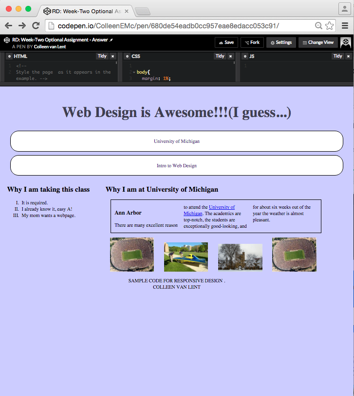

## Assignment 2: OPTIONAL -- Create a responsive style sheet Instructions

This is an ***optional assignment***.  My hope is that by making all Peer graded assessments optional, only students who are willing to put in clear feedback will take part.  It is fine if your submission is not perfect, or even if you are still struggling on it.  But please make sure that you are willing to look closely at your peers' work.

Write a style sheet that will provide three different views of a single HTML file.

### Review criteria

Objectives:

· Create three different styles for a single HTML document

· Successfully trigger multiple views based on viewport and device.

Deliverables:

 Submit a link to your CodePen code or upload a copy of your CSS

 
Background

As you know, it is important to provide different views for
varying viewports.  This can be done
using your own media queries and style rules.   
In this assignment you will take  code provided by  me, and add two additional views. 
You may not modify the HTML file in any way. 

### Starting Point
**Here is  picture of your starting point**.  Don't worry if it looks a little bit different, don't worry about it -- it is probably due to differences in the default browser styling.

The code can be found at [http://codepen.io/ColleenEMc/pen/yOBezm] or you can download a copy of the html and css files here: 

[responsive.html](https://d3c33hcgiwev3.cloudfront.net/_0d68a426fa8b9973662deccfc57b6b0a_responsive.html?Expires=1608681600&Signature=DueixxI1OldosRlTQy3vIvu0LxCcvKdDPOD0kfBAOuzWn77u6wIvMbRkPU9~j0y959I2SRD4JRT6iN36ErCEWoGmuN0Cj5OtAkO1F6L-ZckItxEorsQX5z~IUbsJ3Y1AacAThJnPeQWr96VdFhZgnwJp8TdBCkK6jIPVB95wo24_&Key-Pair-Id=APKAJLTNE6QMUY6HBC5A)

[responsive.css](https://d3c33hcgiwev3.cloudfront.net/_0d68a426fa8b9973662deccfc57b6b0a_responsive.css?Expires=1608681600&Signature=DVopvRZyamAhHg7KMt-hY4cSzcO2G~d35zdmQiaivtwOzdSho3LSdAAaNLWAIt4vhxB7VAgaqjZEsMVnmjMTOWwrobn132b1i60RPzlcshwMUMtPDiDklZn5RLZ60LLH6wF8ImnanfFsc-roFWIt84ZFUglIOI4So1cyCkKBR7Q_&Key-Pair-Id=APKAJLTNE6QMUY6HBC5A)

Now lets do some Responsive Design!!

**Large screen view**

Create a new look for screen sizes that are greater than 900px.  It should look very similar to this:

In particular the properties that I want to see you change are:

a.    
Images are visible

b.    
Sections are next to each other

c.     
Additional text in/after the h1 (See how now it
says “I guess”??) 

Most of the style is straightforward, but I do have some tricky stuff here. The trickiest being the addition of the text "I guess...." after the h1 element. You will need to use the pseudo-element "after" and the property "content".  (Again, since different browsers have different default styles and since you may have a different zoom to your screen, don't worry about other stylistic differences.)

<u>**Print view**</u>

Go back to the mobile view and print the page.  Don't worry if you don't actually have a printer, you can use "Print Preview" or "Print as pdf." 

 If you are using CodePen some of the CodePen code will show up as well, don't worry about that.  All we care about is that a few things are changed, namely:

a. The h1 heading is set to 1em (instead of being big)

b. The navigation links are not styled as much (you need to figure out which parts have changed)

c. The images are gone

d. The background color is removed

You should modify the existing style sheet to create these two views.  When you are done (or as close as you are going to get to done) submit your URL or your code to get some peer-reviews of your work.  You don't need to submit both, just one.

When you are ready, click on "Preview" to see your work before you submit it.
