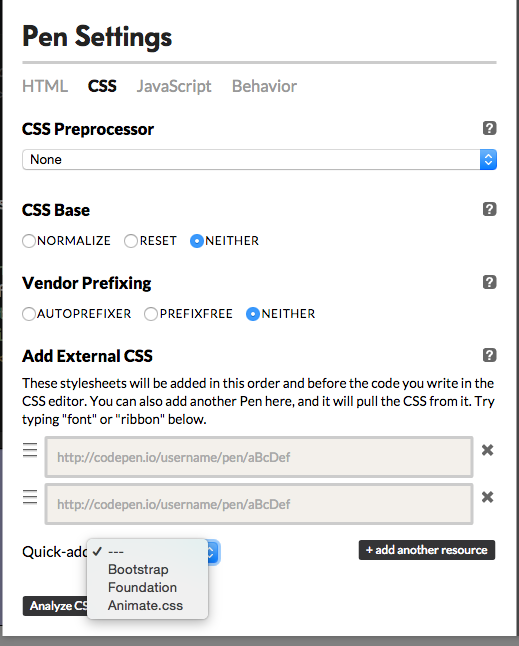
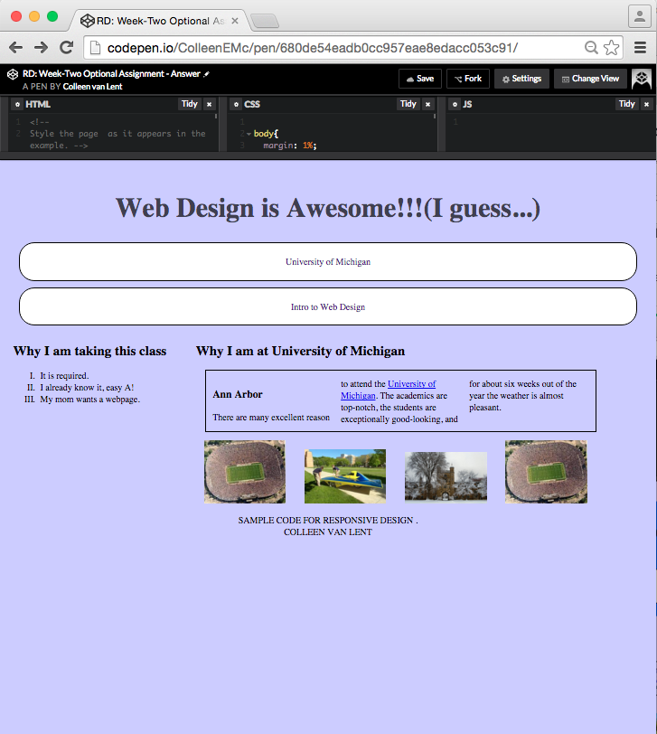

## Assignment 3: OPTIONAL - Use Bootstrap to create a responsive page Instructions

This is an <u>***optional assignment***</u>.  My hope is that by making all Peer graded assessments optional, only students who are willing to put in clear feedback will take part.  It is fine if your submission is not perfect, or even if you are still struggling on it.  But please make sure that you are willing to look closely at your peers' work before you submit.  

Modify your HTML and CSS files to use Bootstrap to augment the responsive layout for a page.

### Review criteria

Objectives:

· Create three different styles for a single HTML document

· Successfully trigger multiple views based on viewport and device.

Deliverables:

Submit a link to your CodePen code or upload a copy of your HTML and CSS.

Background

As you know, it is important to provide different views for varying viewports. This can be done using your own media queries and style rules. However, you can also achieve some of the functionality by incorporating Bootstrap in to your HTML file.

In this assignment you will modify the code you wrote for the Optional Responsive assignment from Week Two. But the big different now is that <u>***you WILL change the HTML code***</u>.  Now, you will trigger some changes using bootstrap classes.  These changes will involve using the grid Bootstrap grid system to realign your sections from full-width, to side-by-side and also using Bootstrap classes to change the visibility of your images and h1 heading.

### Starting Point
Start with the code from Week Two, but remove any rules that:

1) reposition your sections 

2) change the visibility/display properties of your images

3) change the visibility/display properties of your h1 heading.

Next, if you use CodePen, make sure to include the Bootstrap add-on. 

If you are going to use your own editor, make sure to add the the CDN link in your html files so the peer grader does not need a download a copy of the Bootstrap code.

<u>**Extra small and small viewports**</u>

Modify the HTML to use the hidden classes for your images. 

<u>**Large screen view**</u>

Create a new look for medium and larger screen sizes.  It should be the same as the earlier assignment. 

But now, use Bootstrap classes instead of a media query to position the sections next to each other.

<u>**Print view**</u>

In the print view, modify the HTML to use the hidden classes for your images and the h1 heading.

When you are done (or as close as you are going to get to done) submit your URL or your code to get some peer-reviews of your work. You don't need to submit both, just one.

When you are ready, click on "Preview" to see your work before you submit it.